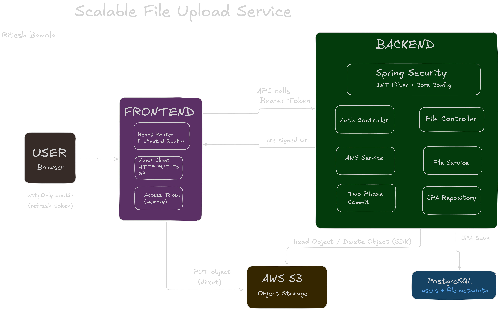
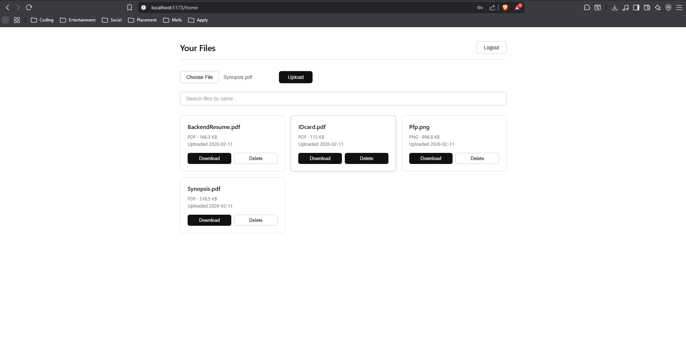

# Scalable File Uploading System

This project enables secure, scalable file uploads where the backend never parses
or stores the file content. Instead, the backend issues pre-signed S3 URLs so the
browser can upload directly to AWS S3. Only the backend holds AWS credentials; the
client never sees them.

The backend remains the source of truth for access control and metadata:
it validates file name/type/size, creates a pending metadata record in MongoDB,
and finalizes that record only after the object is confirmed in S3. This keeps the
system consistent even though file bytes bypass the API server.

This design has two key benefits: it avoids large file payloads on the backend
(better performance and cost) and reduces security exposure by keeping AWS
credentials server-side while still supporting secure, time-limited uploads.

## Features
- Email/password auth with access + refresh tokens
- Refresh token stored as httpOnly cookie
- Protected client routes and API endpoints
- Pre-signed S3 uploads with two-phase confirmation
- File list, search, pagination, download, and delete
- MIME type and file size validation

## Tech Stack
- **Frontend:** React, Vite, React Router, Axios
- **Backend:** Java 17+, Spring Boot 3, PostgreSQL, AWS S3 SDK v2
- **Auth:** JWT (access + refresh tokens via `jjwt`)

## Architecture


## UI Previews
- Login
  
- Signup
  
- Home
  


## Prerequisites
- Java 17 or higher
- Maven 3.8+ (or Gradle)
- PostgreSQL (local or hosted)
- AWS S3 bucket and credentials

## Environment Variables (server)

Create an `application.properties` (or `application.yml`) file inside
`server/src/main/resources/` with:

```properties
server.port=5000

spring.data.mongodb.uri=mongodb://localhost:27017/file_uploads

jwt.access-token-secret=your_access_secret
jwt.refresh-token-secret=your_refresh_secret
jwt.access-token-expiry-ms=900000
jwt.refresh-token-expiry-ms=604800000

aws.region=ap-south-1
aws.bucket-name=your_bucket_name

spring.servlet.multipart.max-file-size=5MB
spring.servlet.multipart.max-request-size=5MB
```

AWS credentials are loaded via the default SDK provider chain
(for example, `AWS_ACCESS_KEY_ID` and `AWS_SECRET_ACCESS_KEY` in your environment,
or a configured AWS profile / IAM role).

## Key Dependencies (`pom.xml`)

```xml
<!-- Spring Boot Starters -->
<dependency>
  <groupId>org.springframework.boot</groupId>
  <artifactId>spring-boot-starter-web</artifactId>
</dependency>
<dependency>
  <groupId>org.springframework.boot</groupId>
  <artifactId>spring-boot-starter-data-mongodb</artifactId>
</dependency>
<dependency>
  <groupId>org.springframework.boot</groupId>
  <artifactId>spring-boot-starter-security</artifactId>
</dependency>

<!-- JWT -->
<dependency>
  <groupId>io.jsonwebtoken</groupId>
  <artifactId>jjwt-api</artifactId>
  <version>0.12.5</version>
</dependency>
<dependency>
  <groupId>io.jsonwebtoken</groupId>
  <artifactId>jjwt-impl</artifactId>
  <version>0.12.5</version>
  <scope>runtime</scope>
</dependency>
<dependency>
  <groupId>io.jsonwebtoken</groupId>
  <artifactId>jjwt-jackson</artifactId>
  <version>0.12.5</version>
  <scope>runtime</scope>
</dependency>

<!-- AWS S3 SDK v2 -->
<dependency>
  <groupId>software.amazon.awssdk</groupId>
  <artifactId>s3</artifactId>
  <version>2.25.0</version>
</dependency>
<dependency>
  <groupId>software.amazon.awssdk</groupId>
  <artifactId>s3-presigner</artifactId>
  <version>2.25.0</version>
</dependency>
```

## Local Development

### Backend

```bash
cd server
./mvnw spring-boot:run
```

Server runs at `http://localhost:8080` and allows CORS from `http://localhost:5173`.

### Frontend

```bash
cd client
npm install
npm run dev
```

Client runs at `http://localhost:5173`.

## API Reference

Base URL: `http://localhost:8080`

### Auth

| Method | Endpoint | Description                                                                 |
|--------|---------|-----------------------------------------------------------------------------|
| POST   | /signup | Registers a new user account                                                |
| POST   | /signin | Authenticates a user; returns an access token and sets a refresh token cookie |
| POST   | /refresh | Rotates the refresh token and returns a new access token                    |
| POST   | /logout | Clears the refresh token cookie                                             |

### Files (requires Authorization header)

Set header: `Authorization: Bearer <accessToken>`

| Method | Endpoint              | Description                                              |
|--------|-----------------------|----------------------------------------------------------|
| POST   | /files/request-upload | Validates metadata and returns a pre-signed S3 upload URL |
| POST   | /files/confirm-upload | Verifies the S3 object exists and finalizes metadata     |
| GET    | /files                | Returns all files for the current user                   |
| GET    | /files/{fileId}       | Returns a pre-signed S3 download URL                     |
| DELETE | /files/{fileId}       | Deletes the file from S3 and removes metadata            |

## Upload Flow (Two-Phase)

1. Request metadata and upload URL via `POST /files/request-upload`
2. Upload directly to S3 using the returned `uploadURL` (HTTP PUT)
3. Confirm the upload via `POST /files/confirm-upload`
4. The file is now visible in `GET /files`

## Client Usage

- Sign up at `/signup`
- Log in at `/login` (access token stored in memory, refresh via cookie)
- After login, access the dashboard at `/home`
- Upload, search, download, and delete files

## Security Configuration

Spring Security is configured to:
- Permit unauthenticated access to `/**`
- Require a valid JWT Bearer token for all `/files/**` routes
- Register a `JwtAuthenticationFilter` that runs before `UsernamePasswordAuthenticationFilter`
- Disable CSRF (stateless JWT API)
- Allow CORS from `http://localhost:5173`

## Notes and Limitations

- Passwords are currently stored in plain text. Add BCrypt hashing (via `BCryptPasswordEncoder`) before production use.
- Refresh token cookie uses `secure = false` in the local dev config; update `ResponseCookie` to `secure(true)` for production (HTTPS).
- Upload limit is 5 MB and only certain MIME types are allowed (enforced in `FileService`).
- The `S3Presigner` client should be declared as a `@Bean` and reused — do not instantiate it per request.

## Planned Enhancements

- Scheduled job (`@Scheduled`) for deleting pending/orphaned file records in MongoDB
- Backend pagination using Spring Data `Pageable`
- Backend search and sorting via MongoDB queries
- Full frontend wiring for search and pagination UI
